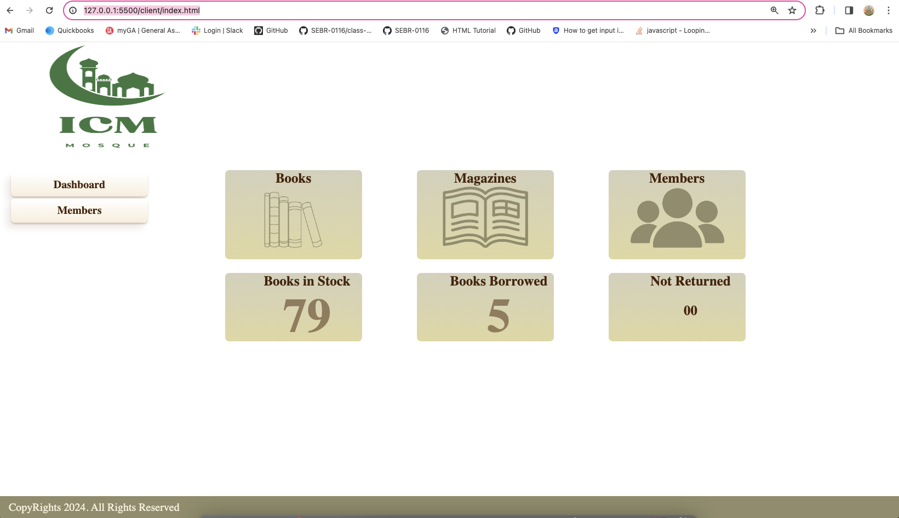
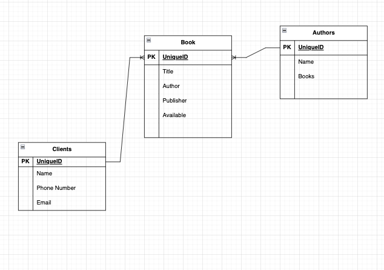
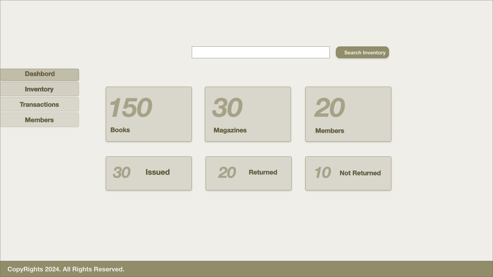
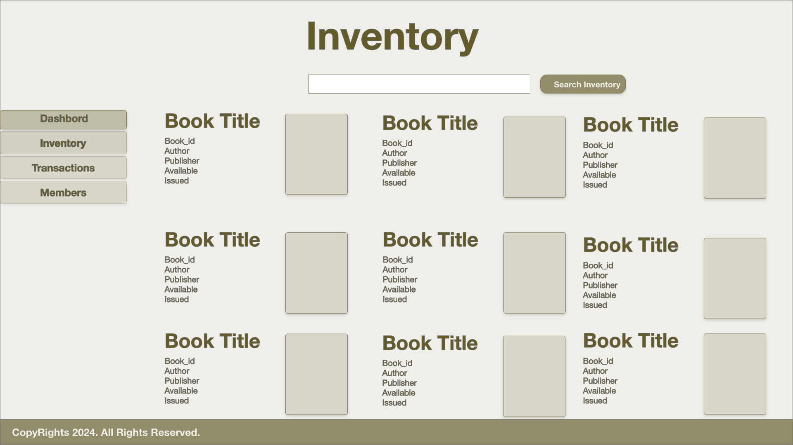
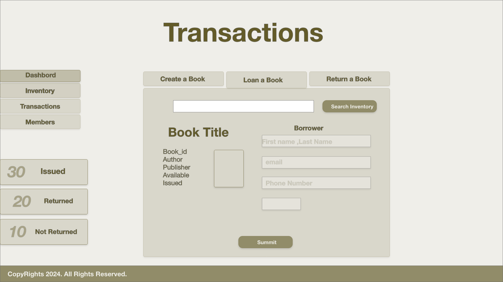
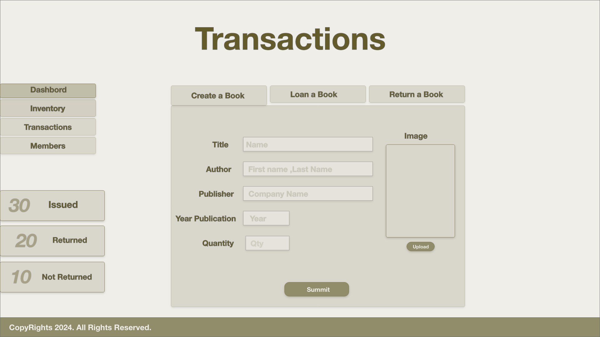

# ICM-Library

## Description

ICM Library Books Management Application  web-based system designed to help the ICM Mosque to manage information related to books, including titles, authors, publishers, quantities in stock, and more. 

## Tecnologies Used 

MongoDB
JavaScript
HTML
CSS

## Getting Started 

http://127.0.0.1:5500/client/index.html 

## ERD/ WIREFRAME 

## Next Steps : 
I planned to keep working on this application to one day offer it to the Mosque so they can actually use it. 
 
### Sources : 
https://www.youtube.com/watch?v=TlP5WIxVirU